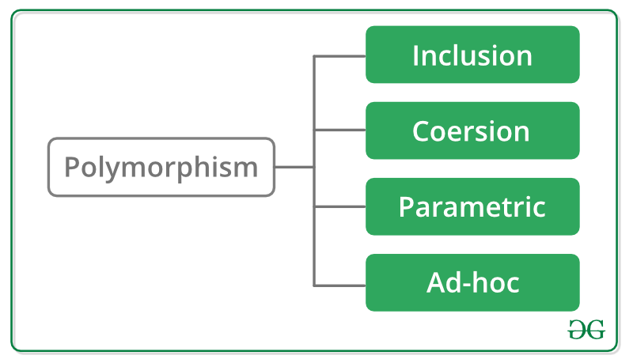

# Polymorphism

<figure><figcaption></figcaption></figure>

## Inclusion


## Coersion


## Parametric


### Examples

*   **C++ Template (Static)**

    The types are taken as variables and then instantiated with particular type as needed while compiling.&#x20;

```cpp
template <typename T>
T Add(T a, T b) 
{
    return a + b;
}

int main()
{
    return Add<int>(1, 2); 
}
```

## Ad-hoc


### Examples:

*   **C++ Operator Overload (Dynamic)**

    The same operator shows different behaviours for different types.

```cpp
"A" + "B" // "AB" : String Concatenation
 1  +  2  //  3   : Integer Addition
```

*   **C++ Function Overload (Dynamic)**

    Dynamically choose which function to use while running.

```cpp
int get(int a) { return a; }
int get(int a, int b) { return a + b; }
int get(int a, int b, int c) { return a + b + c; }
...
```

## Sub-Type


### Examples:

*   C++ Virtual Table


## Articles





### FP:&#x20;



### OOP:




